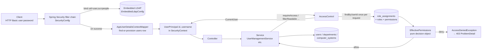
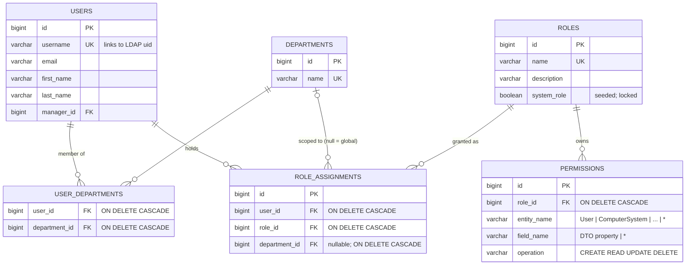
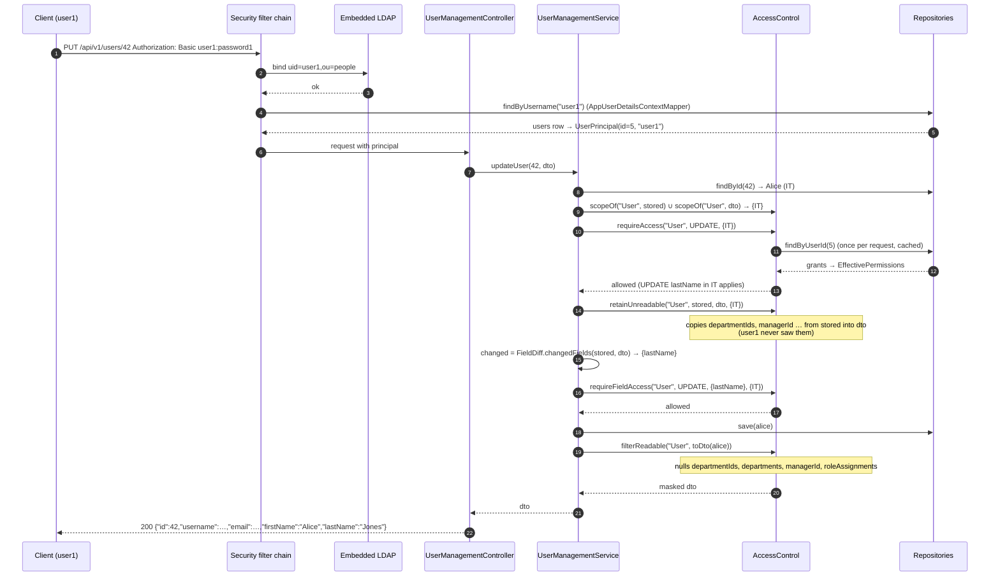
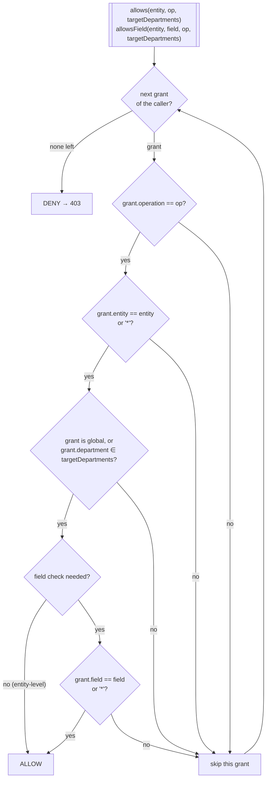
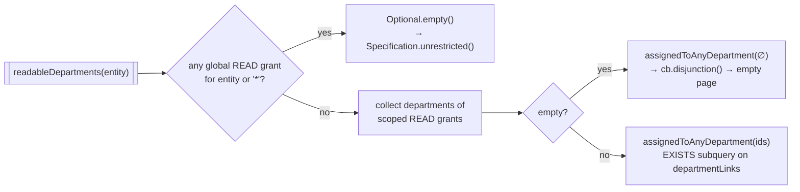
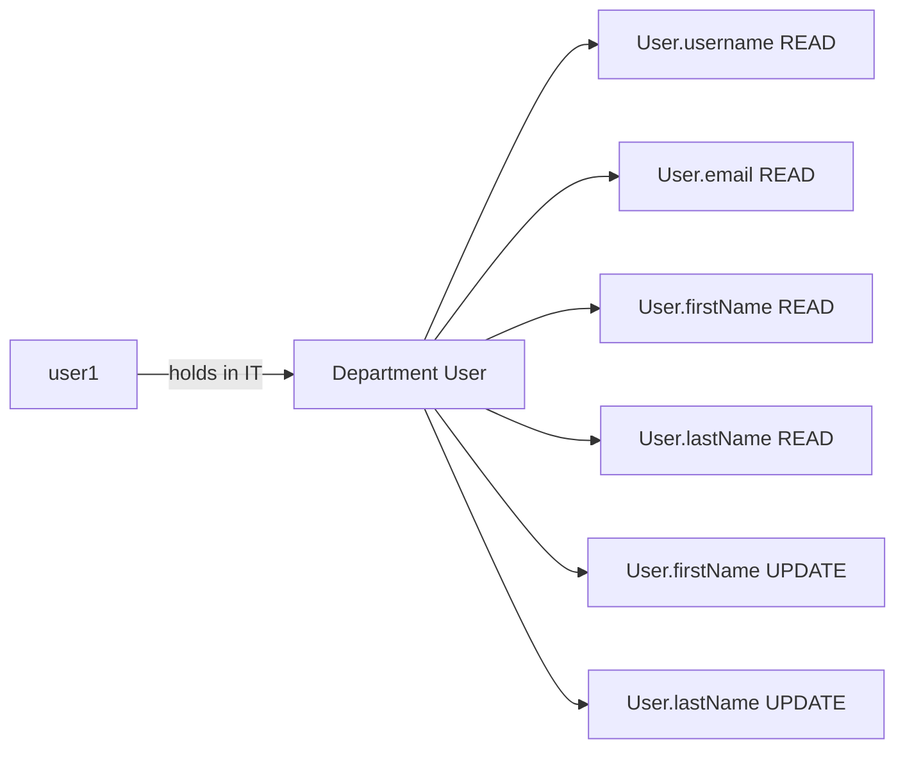
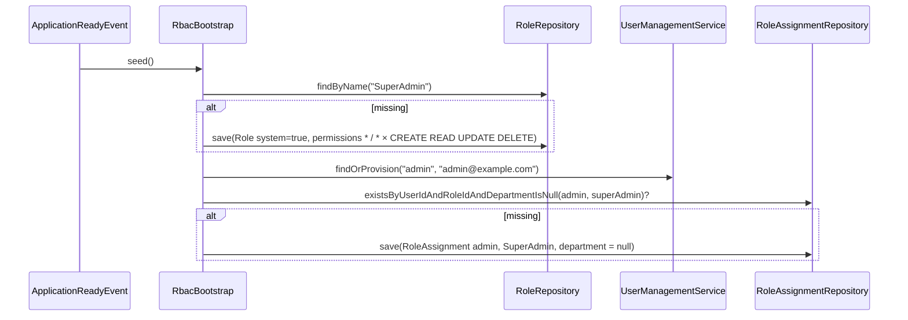
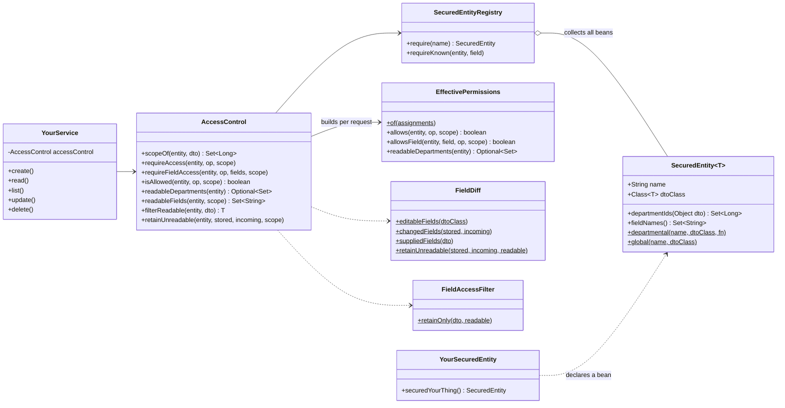

# Role-Based Access Control — developer guide

This guide explains **how the RBAC system works and why it is shaped the way it is**, for a
developer who knows Spring but has not read the code. The README holds the reference material
(endpoints, configuration keys, first-time-use table); this document is the tour.

- [1. The problem and the three concepts](#1-the-problem-and-the-three-concepts)
- [2. The big picture](#2-the-big-picture)
- [3. Data model](#3-data-model)
- [4. A request, end to end](#4-a-request-end-to-end)
- [5. The decision rules](#5-the-decision-rules)
- [6. Field-level semantics](#6-field-level-semantics)
- [7. Worked example: Department User](#7-worked-example-department-user)
- [8. Bootstrap and first-time use](#8-bootstrap-and-first-time-use)
- [9. The RBAC endpoints govern themselves](#9-the-rbac-endpoints-govern-themselves)
- [10. Extending it: securing a new entity](#10-extending-it-securing-a-new-entity)
- [11. Testing map](#11-testing-map)
- [12. Design choices and known limits](#12-design-choices-and-known-limits)

---

## 1. The problem and the three concepts

We want to say things like *"a Department User may read the names of users in their own
department and edit those names, and nothing else"* — and we want to say it **at runtime, as
data**, not as annotations compiled into the code. Three concepts carry the whole design:

| Concept | What it is | Where |
|---|---|---|
| **Secured entity** | A kind of thing that can be protected — `User`, `ComputerSystem`, `Department`, `Role`, `RoleAssignment`. Each is registered with the DTO whose JSON property names are its legal **field** names. | `SecuredEntity`, `SecuredEntityRegistry`, one `*SecuredEntity` config per feature |
| **Role → permissions** | A named set of `entity : field → operation` grants. `operation` ∈ `CREATE READ UPDATE DELETE`; `*` is a wildcard for entity or field. A role says nothing about *who* or *where*. | `Role`, `Permission`, `RoleService` |
| **Assignment (grant)** | *user* holds *role* in *department*. `department = null` means **global**. A user may hold any number of grants. | `RoleAssignment`, `RoleAssignmentService` |

Two invariants follow from that and are worth memorising:

1. **Authorization is data.** The only grant not created through the API is the seeded
   `SuperAdmin` for the bootstrap user. Everything else — roles, their permissions, who holds
   what where — is rows.
2. **Enforcement lives in the service layer.** Not in URL patterns, not in annotations. The service
   is the one place that knows the object *and* which departments it belongs to, and scope is
   what a Department:Role grant is about.

## 2. The big picture



Read this as two halves. The **left half is authentication** and is the only place the directory
appears: Spring Security binds as the caller, and `AppUserDetailsContextMapper` turns the LDAP
entry into a `UserPrincipal` backed by a `users` row (creating the row on first login). LDAP groups
are never read. The **right half is authorization**: the service asks `AccessControl` questions,
`AccessControl` loads the caller's grants once per request and folds them into an
`EffectivePermissions` snapshot, and every decision is a pure function over that snapshot. The
`users` table is the hinge — it holds both the profile and the grants, and it is linked to the
directory by `username`.

Key classes:

| Concern | Class | Package |
|---|---|---|
| Directory + provider | `EmbeddedLdapConfig`, `LdapProperties` | `feature.security.ldap` |
| Identity | `UserPrincipal`, `CurrentUser`, `AppUserDetailsContextMapper`, `ProblemDetailAuthenticationEntryPoint` | `feature.security.auth` |
| Decision API | `AccessControl` | `feature.security.rbac.access` |
| Rules | `EffectivePermissions` | `feature.security.rbac.access` |
| Field mechanics | `FieldDiff`, `FieldAccessFilter` | `feature.security.rbac.access` |
| Extension point | `SecuredEntity`, `SecuredEntityRegistry` | `feature.security.rbac.access` |
| Roles and permissions | `Role`, `Permission`, `Operation`, `RoleService`, `RoleController`, `RoleSecuredEntity` | `feature.security.rbac.role` |
| Grants | `RoleAssignment`, `RoleAssignmentService`, `RoleAssignmentController`, `RoleAssignmentSecuredEntity` | `feature.security.rbac.assignment` |
| Seed | `RbacBootstrap`, `RbacProperties` | `feature.security.rbac.bootstrap` |

The `rbac` package is split by responsibility: `role` and `assignment` are ordinary feature slices
(entity, DTO, mapper, repository, service, controller), `access` is the engine every service calls,
and `bootstrap` is the one-off seed. Dependencies point from `role`/`assignment` into `access`
(services call `AccessControl`) and from `access` back to the two entities it evaluates
(`EffectivePermissions` reads `RoleAssignment` → `Role` → `Permission`); nothing depends on
`bootstrap`.

## 3. Data model



Things to notice:

- **`permissions` rows belong to their role.** `Role.permissions` is an owned collection
  (`cascade = ALL, orphanRemoval = true`); there is no `PermissionRepository`. Unique on
  `(role_id, entity_name, field_name, operation)`. `RoleService.reconcilePermissions` *diffs* the
  requested list against the stored one rather than clearing and re-adding — Hibernate flushes
  inserts before deletes, so re-submitting an existing grant would otherwise hit the unique key.
- **Every FK on `role_assignments` cascades.** Deleting a user, a role or a department silently
  removes the grants that referenced it. This is the same "deletion is never blocked" philosophy
  the department join tables follow, and it is asserted straight out of `INFORMATION_SCHEMA` by
  `RoleAssignmentRepositoryIT` and `DepartmentCascadeIT`.
- **`department_id = NULL` is a global grant.** SQL treats NULLs as distinct in the unique key, so
  `RoleAssignmentService.grant` checks for an existing global grant itself.
- **`system_role`** marks the seeded `SuperAdmin`: it cannot be renamed, deleted or
  re-permissioned through the API (409), because losing the wildcard role would lock everyone out.

What "scope" means depends on the entity — the `SecuredEntity` descriptor decides:

| Secured entity | Scope of one object | Declared in |
|---|---|---|
| `User` | its `departmentIds` | `UserSecuredEntity` |
| `ComputerSystem` | its `departmentIds` | `ComputerSystemSecuredEntity` |
| `Department` | its own `id` (a department is its own scope; a *new* one has none) | `DepartmentSecuredEntity` |
| `Role` | none — only global grants reach roles | `RoleSecuredEntity` |
| `RoleAssignment` | the department it grants (`null` → none) | `RoleAssignmentSecuredEntity` |

## 4. A request, end to end

The canonical enforcement pattern is in `UserManagementService`. Here is `PUT /api/v1/users/{id}`
performed by `user1`, who holds *Department User* in IT (READ `username email firstName lastName`,
UPDATE `firstName lastName`) and is changing Alice's last name:



Read this as **six checkpoints**, always in the same order:

1. `scopeOf` — which departments does the object belong to? For an update, the union of where it
   *is* and where the request *puts* it, so you cannot move an object into a department you do
   not control.
2. `requireAccess` — entity-level: may the caller do this operation to objects in that scope?
3. `retainUnreadable` — fields the caller cannot read are copied from the stored object into the
   request, so they can never register as changes.
4. `FieldDiff.changedFields` + `requireFieldAccess` — only fields whose value actually differs are
   "written", and each must be covered by an UPDATE grant.
5. The ordinary business logic (duplicates, associations, save).
6. `filterReadable` — the response is masked to the caller's readable fields. Masked fields are
   nulled, and `@JsonInclude(NON_NULL)` on the DTO turns that into **omission** from the JSON.

Had step 2 or 4 failed, `AccessControl` throws Spring Security's `AccessDeniedException`;
`GlobalExceptionHandler` maps it to an RFC 9457 **403** whose `detail` says exactly what was
refused, e.g. `Not permitted to UPDATE User field(s) [email] in department(s) [3]`.

The same shape, minus the diff, applies to create (`suppliedFields` instead of `changedFields`),
read (`requireAccess(READ)` then `filterReadable`) and delete (`requireAccess(DELETE)`). Lists are
different — see §5.

## 5. The decision rules

Everything reduces to one question asked of `EffectivePermissions`: *does any grant the caller
holds apply?* A **grant** is one permission tagged with the department of the assignment that
carried it (`null` for global).



Three consequences of this diagram are easy to get wrong, so they are spelled out:

- **An empty target scope can only be satisfied by a global grant.** A user in no department, a
  role, a department being created — none of them has a department for a scoped grant to match.
  The 403 says so: `(requires a global grant)`.
- **A field-level grant confers entity-level access.** `allows` does not look at the field, so
  someone holding only `READ User.firstName` in IT may read IT users — and `filterReadable` then
  leaves them exactly `id` and `firstName`. This is what makes "narrow" roles work without a
  separate entity-level permission.
- **Scope is per object, not per request.** The same caller may be allowed on Alice (IT) and
  denied on Carol (HR) within one list.

Lists cannot ask per object *before* the query, so they ask a different question:



So a caller with no grants gets a **200 with an empty page**, not a 403 — there is nothing to
deny, there is just nothing they can see. Each item that *is* returned is still passed through
`filterReadable`. Departments use `idIn(ids)` instead of the join, because a department is its
own scope. Roles have no scope, so `RoleService` uses `requireAccess(READ, ∅)` and listing roles
without a global grant is a 403 — there is no partial view of a role.

Implementation notes: `AccessControl.effective()` loads the caller's assignments with one graphed
query (`RoleAssignmentRepository.findByUserId` → role, role.permissions, department) and caches the
`EffectivePermissions` as a request attribute, so several checks in one request cost one query.
`EffectivePermissions` itself has no Spring or JPA dependency — `EffectivePermissionsTest` covers
the rules with plain objects.

## 6. Field-level semantics

Field names are the **DTO's JSON property names** — what clients see is what administrators grant.
`SecuredEntityRegistry.requireKnown` rejects a permission for a field the DTO does not have, so a
typo becomes a 400 at write time instead of a permission that silently never matches.

| Operation | What is checked | Mechanism |
|---|---|---|
| READ | which properties survive into the response | `FieldAccessFilter.retainOnly` nulls everything not readable (never `id`); `@JsonInclude(NON_NULL)` omits them |
| CREATE | every non-null, non-empty property the client sent | `FieldDiff.suppliedFields` |
| UPDATE | only properties whose value **differs** from the stored object | `FieldDiff.changedFields`, after `retainUnreadable` |
| DELETE | entity-level only (a DELETE permission must use field `*`) | validated in `RoleService.validated` |

`FieldDiff` works on the DTO's *editable* properties: everything with a setter except `id` and
properties whose field is marked `@Schema(accessMode = READ_ONLY)` (derived data such as
`departments` and `roleAssignments`, which a client echoes back but never writes). Null and empty
collections are treated as the same value, matching the services, where both clear an association.

The **ignored-on-write rule** is the part newcomers most often question, so here is the reasoning.
A narrow role does `GET` and sees `{id, username, email, firstName, lastName}`. It edits
`lastName` and does a full-replacement `PUT` with that body — `departmentIds` and `managerId` are
absent. Without special handling the diff would read that as "clear the departments and the
manager", and either wipe data or (correctly but uselessly) 403 the user for touching fields they
were never shown. `retainUnreadable` resolves it: a field the caller cannot READ is copied from the
stored object before the diff, so unseen fields are never changes.

| Field | Caller may READ? | Body sends | Effective value | Counts as write? |
|---|---|---|---|---|
| `lastName` | yes | `"Jones"` (was `"Smith"`) | `"Jones"` | yes → needs UPDATE |
| `firstName` | yes | `"Alice"` (unchanged) | `"Alice"` | no |
| `email` | yes | `"alice.new@…"` | `"alice.new@…"` | yes → 403 without UPDATE on `email` |
| `departmentIds` | no | *(absent)* | stored `[IT]` | no |
| `managerId` | no | *(absent)* | stored `9` | no |

Two consequences to design roles around:

- **UPDATE without READ is inert.** If a role may update `description` but not read it, the
  incoming value is overwritten by the stored one before the diff. Grant READ with every UPDATE.
- **Bean validation still runs first.** `UserDto` requires `username` and `email`;
  `ComputerSystemDto` requires most of its fields. A role that may update those entities must be
  able to read the required fields, or its `PUT` fails with 400 before reaching the service.

## 7. Worked example: Department User

`UserRbacIT` runs this scenario; the numbers below are illustrative ids.

**Set-up, as `admin`** (the bootstrap SuperAdmin):

```bash
# 1. The role
curl -u admin:admin123 -X POST localhost:8080/api/v1/roles -H 'Content-Type: application/json' -d '{
  "name": "Department User",
  "permissions": [
    {"entity":"User","field":"username", "operation":"READ"},
    {"entity":"User","field":"email",    "operation":"READ"},
    {"entity":"User","field":"firstName","operation":"READ"},
    {"entity":"User","field":"lastName", "operation":"READ"},
    {"entity":"User","field":"firstName","operation":"UPDATE"},
    {"entity":"User","field":"lastName", "operation":"UPDATE"}
  ]}'                                                         # 201  → role 2

# 2. Departments and people
curl -u admin:admin123 -X POST localhost:8080/api/v1/departments -d '{"name":"IT"}' ...        # → 1
curl -u admin:admin123 -X POST localhost:8080/api/v1/departments -d '{"name":"HR"}' ...        # → 2
curl -u admin:admin123 -X POST localhost:8080/api/v1/users \
  -d '{"username":"alice","email":"alice@example.com","firstName":"Alice","lastName":"Smith","departmentIds":[1]}'   # → 3
curl -u admin:admin123 -X POST localhost:8080/api/v1/users \
  -d '{"username":"bob","email":"bob@example.com","firstName":"Bob","lastName":"Builder"}'                          # → 4  (no department)
curl -u admin:admin123 -X POST localhost:8080/api/v1/users \
  -d '{"username":"user1","email":"user1@example.com","departmentIds":[1]}'                                          # → 5  (matches the LDAP uid)

# 3. The grant: user1 holds Department User in IT
curl -u admin:admin123 -X POST localhost:8080/api/v1/users/5/role-assignments \
  -d '{"roleId": 2, "departmentId": 1}'                                                                              # 201
```

After that, `user1`'s effective permissions are six grants, all tagged *IT*:



**What `user1` can now do** (`-u user1:password1`):

| Request | Result | Why |
|---|---|---|
| `GET /api/v1/users` | 200, two items (alice, user1), each with only `id username email firstName lastName` | list scoped to IT (`readableDepartments` = {1}); other fields masked |
| `GET /api/v1/users/filter?username=carol` (HR) | 200, `totalElements: 0` | out of scope, filtered by the Specification |
| `GET /api/v1/users/3` (alice) | 200, masked | READ applies in IT |
| `GET /api/v1/users/4` (bob, no department) | 403 `… READ User (requires a global grant)` | empty scope, no global grant |
| `PUT /api/v1/users/3` with the fetched body and `lastName: "Jones"` | 200 | only `lastName` changed; departments/manager retained unseen |
| same `PUT` with a new `email` | 403 `… UPDATE User field(s) [email] in department(s) [1]` | READ on email, but no UPDATE |
| `POST /api/v1/users`, `DELETE /api/v1/users/3` | 403 | no CREATE/DELETE grant |
| `GET /api/v1/roles`, `POST /api/v1/roles` | 403 `… (requires a global grant)` | roles have no scope |

`admin` is unaffected throughout: `SuperAdmin` holds `*`/`*` for every operation, globally.

## 8. Bootstrap and first-time use



`RbacBootstrap` runs on every start and is idempotent (`RbacBootstrapIT`). The username, email and
role name come from `app.rbac.bootstrap.*`; the user must exist in `ldap-users.ldif` or nobody can
log in with full rights. It is the only grant that bypasses the API.

Everyone else who logs in for the first time gets a `users` row provisioned from their directory
entry (`uid`, `mail`, `givenName`, `sn`) and **no grants**: list endpoints return empty pages, every
get-by-id/create/update/delete is a 403 — including their own record — and the RBAC endpoints are
403. The README's [First-time use](../README.md#first-time-use) section has the exact table and
the three admin calls that unlock a user.

## 9. The RBAC endpoints govern themselves

Roles and grants are secured entities too, so the same engine decides who may administer access:

- **`Role` has no scope.** Every role operation needs a *global* grant on `Role`; changing a role's
  permissions is `UPDATE` of `Role.permissions`. Rationale: a role is reusable across departments,
  so letting a department administrator edit one would leak changes into departments they do not
  control.
- **`RoleAssignment` is scoped to the department it grants.** Someone holding `CREATE/READ/DELETE
  RoleAssignment` in IT can hand out and revoke roles *within IT*, sees only IT-scoped grants when
  listing a user's assignments, and cannot create or revoke a global grant. `RbacManagementIT`
  covers this, including a user with no grants trying to grant themselves `SuperAdmin` (403).

A department-scoped grant manager *can* grant a wildcard role within their department; the wildcard
is still bounded by the department, so that is by design — see §12.

## 10. Extending it: securing a new entity



The two `Your…` boxes are all a feature adds; everything else lives in
`feature.security.rbac.access` and is untouched. Checklist:

1. **Declare the descriptor** in the feature package (copy `UserSecuredEntity`):
   `SecuredEntity.departmental("Widget", WidgetDto.class, WidgetDto::getDepartmentIds)` for a
   departmental model, `SecuredEntity.global(...)` for one only global grants should reach, or a
   custom scope function (see `DepartmentSecuredEntity`). Give the `@Bean` method a name that is
   not the class name in lower camel case — the `@Configuration` class itself is registered under
   that name.
2. **Apply the pattern in the service** (copy `UserManagementService`): `scopeOf` →
   `requireAccess` → (`retainUnreadable` → `changedFields` → `requireFieldAccess` for updates,
   `suppliedFields` for creates) → business logic → `filterReadable`. For lists,
   `readableDepartments(...).map(DepartmentSpecifications::assignedToAnyDepartment).orElseGet(Specification::unrestricted)`
   appended to the query.
3. **Prepare the DTO**: `@JsonInclude(JsonInclude.Include.NON_NULL)`; `@Schema(accessMode =
   READ_ONLY)` on derived properties; wrapper types (`Boolean`, not `boolean`) so every property can
   be masked.
4. **Make paged reads Specification-capable** (`JpaSpecificationExecutor`) so the read scope can be
   appended; keep the `departmentLinks` collection name so `assignedToAnyDepartment` works.
5. **Test** with a `WidgetRbacIT`: scoped list, masked fields, 403 outside the scope, GET-then-PUT
   round trip, denied field change. Unit tests mock `AccessControl` (see the `lenient()` set-up in
   `UserManagementServiceTest`).

Nothing in `feature.security.rbac.access` changes (`RoleSecuredEntity` and
`RoleAssignmentSecuredEntity` are themselves just two more descriptors). From then on administrators can write permissions
for `Widget` and any of its DTO fields, and `requireKnown` will reject anything else.

## 11. Testing map

| Rule or component | Proven by |
|---|---|
| Decision rules (scope, wildcard, field-level ⇒ entity-level, empty scope) | `EffectivePermissionsTest`, `AccessControlTest` |
| Update diff, ignored-on-write, supplied fields, read-only properties | `FieldDiffTest` |
| Masking and JSON omission | `FieldAccessFilterTest` |
| Permission validation against DTO fields | `SecuredEntityRegistryTest`, `RoleServiceTest`, `RoleIntegrationIT` |
| List scoping without row fan-out | `DepartmentSpecificationsIT` |
| Data model: unique keys, orphan removal, `ON DELETE CASCADE` on every FK | `RoleRepositoryIT`, `RoleAssignmentRepositoryIT`, `DepartmentCascadeIT` |
| Authentication, JIT provisioning, 401 shape, open actuator | `AuthenticationIT`, `EmbeddedLdapAuthenticationIT`, `AppUserDetailsContextMapperTest` |
| Seed and idempotence | `RbacBootstrapIT` |
| End-to-end scenarios | `UserRbacIT` (worked example), `DepartmentRbacIT`, `ComputerSystemRbacIT` (batch all-or-nothing, non-transactional on purpose), `RbacManagementIT` |
| Per-service denial before side effects | the `*_Denied*` cases in `UserManagementServiceTest`, `DepartmentServiceTest`, `ComputerSystemServiceTest`, `RoleServiceTest`, `RoleAssignmentServiceTest` |

`mvn verify` runs all of it; `@SpringBootTest` classes import `AsAdminMockMvc` so requests
authenticate as `admin` by default and use `asUser(...)` to act as someone else.

## 12. Design choices and known limits

- **No default role on provisioning.** A first login can do nothing until an administrator grants
  a role. The hook for a baseline role would be `RbacBootstrap` or
  `UserManagementService.findOrProvision`.
- **No self scope.** Users cannot read or edit their own record unless a grant reaches it. A
  "self" scope would slot into how `AccessControl` resolves targets.
- **LDAP groups are ignored.** Authorization is entirely database-driven; mapping directory groups
  onto role assignments at login is possible but not done.
- **Department-scoped grant managers can grant any role within their department**, including
  wildcard roles — bounded by the department, so accepted.
- **UPDATE without READ is inert** (§6). Grant both.
- **One query per request.** `EffectivePermissions` is cached as a request attribute; changing a
  user's grants takes effect on their next request.
- **Business exceptions and the circuit breaker.** `AccessDeniedException` and the 400/404/409
  exceptions are on the `databaseQuery` breaker's `ignoreExceptions` list so a burst of denials
  cannot open it.
- **Bootstrap depends on the LDIF.** If `app.rbac.bootstrap.username` is not a directory user, the
  seeded grant exists but nobody can authenticate as its holder.
